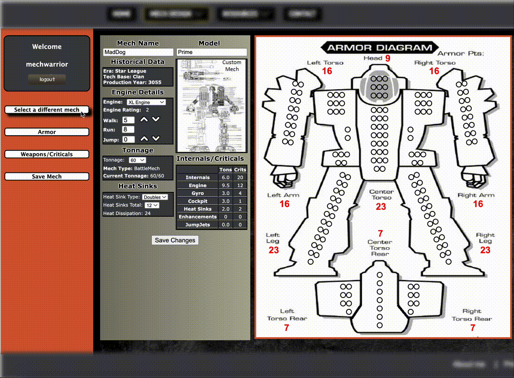

# MechDesign (PHP)

Allows custom editing of your Battlemechs for the boardgame BattleTech

## Description

Passionate about the BattleTech Boardgame, I endeavored to make a web based application allowing customization of Battlemechs while also simultaneously showcasing my skills.

## Getting Started



### Dependencies

-   Docker Desktop

### Installing

-   cp .env.example .env (modify as needed)
-   docker compose down -v
-   docker compose build --no-cache
-   docker compose up -d

### Executing program

-   Navigate to your local browser
-   Step-by-step guide below

```
Navigate to http://localhost:8080/MechDesign/index.php

Save once you customized your mech
```

## Authors

[@NateThurmond](https://github.com/NateThurmond)

## Version History

-   0.3
    -   Final iteration includes docker options for self-launch
    -   Includes init DB scripts so anyone can spin up application
-   0.2
    -   Various bug fixes and optimizations (improved JS event handlers)
    -   See [commit change]() or See [release history]()
-   0.1
    -   Initial Release

## License

This project is licensed under the Apache License, Version 2.0

## Acknowledgments

Inspiration, code snippets, etc.

-   [Camo Specs](https://camospecs.com/)
-   [Solaris Skunk Werks](https://solarisskunkwerks.com/)
-   [BattleTech](https://www.battletech.com/)
